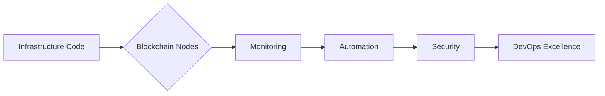

# 👨💻 Gautam Jha  
**DevOps Engineer @ Zeeve Deeptech Pvt Ltd | Blockchain Infrastructure Specialist | Cloud-Native Enthusiast**  
*Building resilient systems at the intersection of DevOps and blockchain*

---

## 🛠️ Core Technical Arsenal

### **DevOps & Cloud-Native Stack**

### **Monitoring & Observability**

### **Blockchain Ecosystem**

### **Cloud Providers**

---

## 🚀 Featured Projects

### **Blockchain Infrastructure Automation**
**Kubernetes | Helm | Terraform**  
Deployed 15+ blockchain protocols (Ethereum/Hyperledger/Arbitrum) with HA configurations  
» Automated node provisioning using Ansible playbooks  
» Implemented cross-chain monitoring with Prometheus/Loki/Grafana stack

### **Baremetal Kubernetes Cluster**
**Kubernetes | Ansible | HAProxy**  
Designed high-availability cluster across 50+ baremetal servers  
» Achieved 99.99% uptime with Istio service mesh integration  
» Reduced deployment times by 70% using GitOps (ArgoCD)

### **Blockchain Explorer Deployment**
**React | Nginx | Prometheus**  
Scalable explorer setup handling 10K+ transactions/minute  
» Implemented SSL termination with automated cert renewal  
» Designed custom dashboards for chain analytics

### **Infrastructure Monitoring Suite**
**Prometheus | Grafana | Zabbix**  
Unified monitoring solution covering:  
» 200+ blockchain nodes  
» 50+ microservices  
» Cloud/baremetal infrastructure  

---

## 🔥 Current Focus
- **Leveling Up**: Golang for backend systems and operator development
- **Optimizing**: Service mesh configurations for blockchain networks
- **Exploring**: Zero-knowledge proof implementations in DevOps pipelines
- **Contributing**: Open-source blockchain DevOps tools

---
## 📝 Latest Contributions

## 📊 GitHub Activity

---

## 🤝 Let's Collaborate!

---

> *"In blockchain DevOps, we don't just deploy nodes - we orchestrate trust."*  
> Always automating the path between code and consensus ⚙️⛓️
